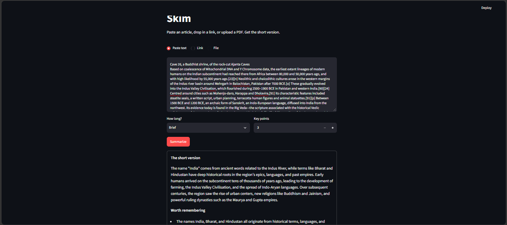

# Skim

A small web app that turns long text into a short summary with key points. You can paste text, give it a link, or upload a PDF or TXT file. It uses the Gemini API and is built with Python and Streamlit.

I built it to practice working with an LLM API in a way that holds up outside a happy-path demo: rate limits, malformed responses, long documents, and clear error messages.

**Live demo:** [add your Streamlit link here once deployed]



## What it does

- Takes input three ways: pasted text, a web page URL, or an uploaded PDF/TXT file
- Lets you choose the summary length (brief, standard, thorough) and how many key points you want (3 to 7)
- Returns a summary and a list of key points
- Handles long documents by splitting them into chunks, summarizing each one, then summarizing the combined result
- Retries failed API calls with exponential backoff and a little random jitter when it hits rate limits (429) or server errors
- Asks the model for JSON, validates it, and retries once if the response comes back malformed
- Logs API calls, retries, response times and errors to `app.log`
- Shows readable error messages to the user and keeps full tracebacks in the log only

## Built with

Python, Streamlit, Gemini API (`google-genai`), Requests, BeautifulSoup, pypdf

## Project structure

```
app.py           Streamlit interface
summarizer.py    Prompts, JSON parsing, chunking, API calls
extractor.py     Pulls text from URLs, PDFs and TXT files
utils.py         Logging setup and the retry-with-backoff decorator
test_retry.py    Small script that simulates rate limits to test the retry logic
```

## How it works

1. The extractor turns the input into plain text. For web pages it removes scripts, menus and footers first.
2. If the text is longer than 12,000 characters, it is split into chunks on line boundaries and each chunk is summarized separately.
3. A final prompt asks for JSON with a `summary` and `key_takeaways`. The response is parsed and checked, and the call is retried once if the JSON is broken.
4. Every API call goes through one function wrapped in a retry decorator, so retries and logging apply everywhere.

## Run it locally

```
git clone https://github.com/YOUR-USERNAME/YOUR-REPO.git
cd YOUR-REPO
python -m venv venv
venv\Scripts\activate          # Mac/Linux: source venv/bin/activate
pip install -r requirements.txt
```

Get a free API key from Google AI Studio and create a `.env` file in the project folder:

```
GEMINI_API_KEY=your_key_here
```

Optionally set `GEMINI_MODEL` in `.env` to use a different model. Then start the app:

```
streamlit run app.py
```

## Things I ran into

- Gemini retired the model I started with, which gave a 404. I moved the model name into an environment variable so changing it doesn't need a code edit.
- I accidentally committed my `.env` file at first. I removed it from the history and replaced the key.
- The free API tier has strict rate limits, which is what pushed me to build the backoff logic properly and test it with a fake 429.

## Limitations and ideas

- Pages that need JavaScript or a login can't be read (a headless browser such as Playwright could fix that)
- Scanned PDFs have no text layer and would need OCR
- Chunks are summarized one after another, so very long documents are slow. Running them in parallel would help
- Summarizing summaries can lose detail, so overlapping chunks could improve quality
- No caching or history yet